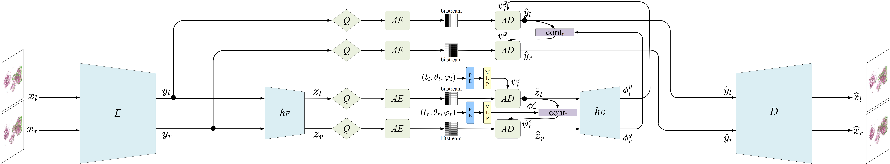
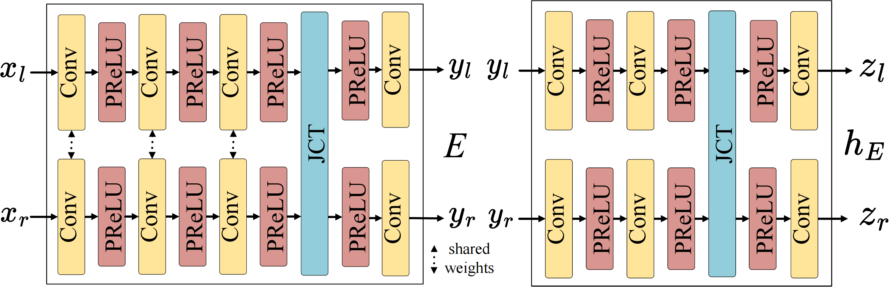
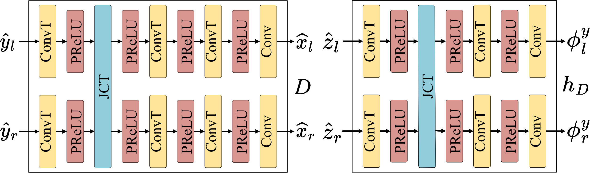
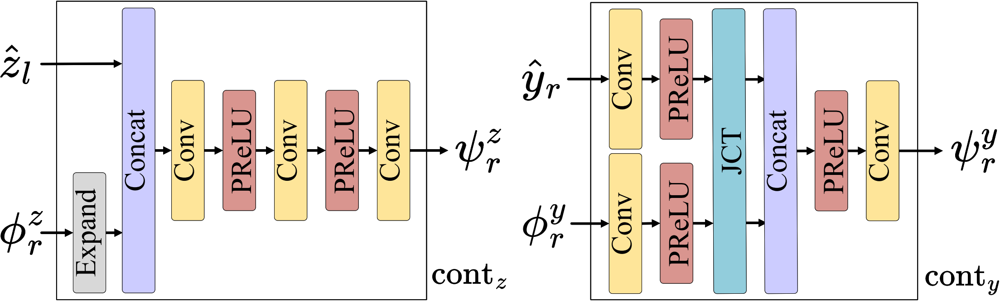

# FCNR: Fast Compressive Neural Representation of Visualization Images

Yunfei Lu, Pengfei Gu, Chaoli Wang

This is the official pytorch implementation for the paper "FCNR: Fast Compressive Neural Representation of Visualization Images". 



<div style="display: flex; justify-content: space-between;">
  
  
  
</div>


### Get Started

Set up a conda environment with all dependencies with Python 3.9:

```
pip install -r requirements.txt
```

## Data 
You can generate customized visualization images with different viewpoints and timesteps on your own dataset via volume or isosurface rendering. Here is a link to download the vortex dataset we use: <a href="https://drive.google.com/drive/folders/1oXtXkXnzUrhfcK8YgHmV52jEwd6dbYm0?usp=sharing">vortex</a>. 

### Training & Inference
Specify `<gpu_idx>`, `<exp_name>` and `<config_name>` to start training and inferencing:

```
python train.py <gpu_idx> <exp_name> --config ./configs/<config_name>
```

An example of the configuration file we use is `./configs/cfg.json`. You can follow it to implement on your customized dataset.


### Citation
```
@article{lu2024fcnr,
  title={FCNR: Fast Compressive Neural Representation of Visualization Images},
  author={Lu, Yunfei, Gu, Pengfei, and Wang, Chaoli},
  journal={2024 IEEE Visualization and Visual Analytics (VIS)},
  booktitle={2024},
  note={Accepted}
}
```


